  

   

  
  
  

  <h1>Awesome Stochastic Gradient Descent (SGD)</h1>

## 📉 The Stochastic Gradient Descent (SGD) Map

> **A comprehensive reference guide and curated list for Stochastic Gradient Descent (SGD)—tracking its mathematical variants, adaptive extensions, diverse applications, and hardware implementations.**

Stochastic Gradient Descent is the foundational optimization engine of modern Machine Learning (ML) and Deep Learning (DL). This repository maps out its entire ecosystem to help practitioners choose the right optimizer variant for their specific workloads, architectures, and performance needs.

---

## 🧭 Core Variants & Mathematical Types

The fundamental ways the gradient step is calculated, balancing convergence speed against computational overhead.

*   **Vanilla SGD 🍦:** Updates model parameters using the gradient of a single, randomly sampled training example at a time.
    *   *Equation:* $\theta = \theta - \eta \cdot \nabla_\theta J(\theta; x^{(i)}, y^{(i)})$
    *   *Trade-off:* High variance in updates, but extremely fast per iteration.
*   **Mini-Batch SGD 📦:** The industry standard. Computes gradients over a small, randomized subset (batch) of data.
    *   *Equation:* $\theta = \theta - \eta \cdot \frac{1}{B} \sum_{i=1}^B \nabla_\theta J(\theta; x^{(i)}, y^{(i)})$
    *   *Trade-off:* Reduces update variance, leverages GPU parallelization efficiently.
*   **SGD with Momentum 🏎️:** Adds a fraction of the previous update vector to the current step to damp oscillations and accelerate through plateaus.
    *   *Equation:* $v_t = \gamma v_{t-1} + \eta \nabla_\theta J(\theta)$, $\theta = \theta - v_t$
    *   *Trade-off:* Prevents getting stuck in local minima; introduces a new hyperparameter ($\gamma$).
*   **Nesterov Accelerated Gradient (NAG) 🔮:** A "look-ahead" momentum. Computes the gradient not at the current position, but at the predicted future position.
    *   *Equation:* $v_t = \gamma v_{t-1} + \eta \nabla_\theta J(\theta - \gamma v_{t-1})$
    *   *Trade-off:* Provides significantly better responsiveness and faster convergence in sharp valleys.

---

## ⚡ Adaptive & Extended Optimizers (The SGD Lineage)

Algorithms that adaptively scale learning rates per parameter, built directly on top of SGD principles. Perfect for complex loss landscapes.

*   **AdaGrad (Adaptive Gradient) 📏:** Scales the learning rate inversely proportional to the square root of the sum of all historical squared gradients.
    *   *Best For:* Sparse features (e.g., text processing, recommendation systems).
*   **RMSprop (Root Mean Squared Propagation) 📉:** Modifies AdaGrad to use an exponentially decaying average of historical squared gradients.
    *   *Best For:* Non-stationary problems and Recurrent Neural Networks (RNNs).
*   **Adam (Adaptive Moment Estimation) 🧠:** Combines the principles of both RMSprop (second moment) and Momentum (first moment).
    *   *Best For:* General purpose deep learning (Transformers, CNNs).
*   **AdamW (Adam with Decoupled Weight Decay) 🏋️:** Decouples weight decay from the gradient update step, fixing a bug in Adam's original L2 regularization.
    *   *Best For:* Large Language Model (LLM) pre-training.

---

## 🛠️ Advanced Architectural Variants

Modified SGD frameworks engineered to solve specific optimization challenges like communication bottlenecks, large-scale distributed training, or non-convex surfaces.

*   **Asynchronous SGD (A-SGD / Hogwild!) 🌪️:** Multiple parallel workers compute gradients independently and update a shared parameter server without locking memory.
    *   *Use Case:* Massive scale cluster training where worker synchronization delays are unacceptable.
*   **Synchronous SGD (S-SGD) 🔄:** Workers compute gradients in parallel on different batches, but wait for all gradients to be averaged before executing the parameter update.
    *   *Use Case:* Data-parallel distributed training (e.g., PyTorch DDP).
*   **Stochastic Variance Reduced Gradient (SVRG) 🎯:** Periodically computes a full gradient to explicitly reduce the variance introduced by the stochastic sampling of SGD.
    *   *Use Case:* High-precision optimization in convex or near-convex empirical risk minimization.
*   **Normalized SGD 📐:** Rescales the gradient update step to have a unit norm, making the optimization step size independent of the gradient's magnitude.
    *   *Use Case:* Training highly unstable architectures or mitigating exploding gradients.

---

## 🚀 Real-World Applications by Domain

Where and why specific versions of SGD are deployed in production systems across different AI domains.

### 🌐 Computer Vision (CV) 👁️
*   **Application:** Training ResNets, Vision Transformers (ViTs), and Object Detectors (YOLO).
*   **Preferred Variant:** **Mini-Batch SGD with Momentum**.
*   **Why:** While adaptive methods converge faster initially, traditional SGD with momentum frequently yields better final generalization scores on image classification datasets.

### ✍️ Natural Language Processing (NLP) & GenAI 🤖
*   **Application:** Pre-training and fine-tuning Large Language Models (LLMs) like Llama, GPT, and Mistral.
*   **Preferred Variant:** **AdamW**.
*   **Why:** Handles sparse token distributions efficiently while ensuring weight decay regularizes the massive parameter space correctly without distortion.

### 🛍️ Recommendation Systems 🛒
*   **Application:** Collaborative filtering, Matrix Factorization, and Click-Through-Rate (CTR) prediction models (e.g., DLRM).
*   **Preferred Variant:** **AdaGrad** or sparse variants of SGD.
*   **Why:** User-item interaction matrices are deeply sparse; parameters for rare items require larger relative updates when they occasionally appear.

### 🏦 Reinforcement Learning (RL) 🎮
*   **Application:** Deep Q-Networks (DQN) and Proximal Policy Optimization (PPO) in robotics or gaming agents.
*   **Preferred Variant:** **RMSprop** or **Adam**.
*   **Why:** Reward distributions shift rapidly as the agent explores, requiring an optimizer that heavily weights recent gradient history over older history.

---

## 💻 Hardware-Level Implementation Paradigms

How SGD maps down to the physical silicon to optimize compute pipelines and maximize hardware utilization.

*   **Mixed-Precision SGD (FP16 / BF16) ⚡:** Stores weights and computes gradients using half-precision floats, keeping a master copy in FP32 to prevent underflow.
    *   *Impact:* Cuts GPU VRAM footprint in half; unlocks Tensor Core processing speeds.
*   **Quantized SGD (QSGD) 🗜️:** Quantizes the gradient vectors into low-bit representations (e.g., 4-bit or 8-bit) before transmitting them across nodes.
    *   *Impact:* Directly minimizes the communication bottleneck in distributed multi-node clusters.
*   **Gradient Accumulation 🧱:** Simulates a larger mini-batch size by accumulating gradients over multiple forward/backward passes before calling the optimizer step.
    *   *Impact:* Allows individual consumer GPUs to train models with batch sizes that would otherwise cause Out-Of-Memory (OOM) errors.

##  Star History

<a href="https://www.star-history.com/?repos=ishandutta2007%2FAwesome-Stochastic-Gradient-Descent&type=date&legend=bottom-right">
<picture>
<source media="(prefers-color-scheme: dark)" srcset="https://api.star-history.com/chart?repos=ishandutta2007/Awesome-Stochastic-Gradient-Descent&type=date&theme=dark&legend=bottom-right" />
<source media="(prefers-color-scheme: light)" srcset="https://api.star-history.com/chart?repos=ishandutta2007/Awesome-Stochastic-Gradient-Descent&type=date&legend=bottom-right" />

</picture>
</a>

